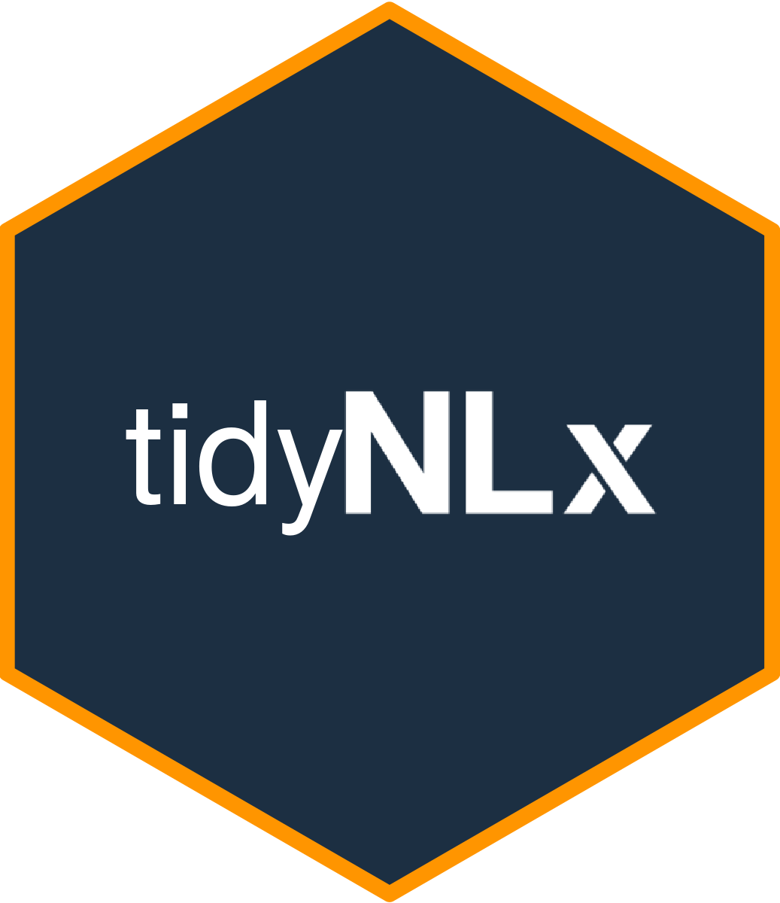

<!-- README.md is generated from README.Rmd. Please edit that file -->

# tidynlx 

<!-- badges: start -->
<!-- badges: end -->

tidynlx provides users with a simple way to interface with NLX’s APIs
and return tidyverse-ready tibbles.

## NLx Research Hub Overview

The NLx Research Hub API provides access to job posting data provided by
the National Labor Exchange in partnership with DirectEmployers. The NLx
has recently completed a migration of its historical data warehouse to a
new data warehouse that improves data processing, reliability, and
availability.

Data from the NLx Research Hub is provided through two APIs:

-   **Synchronous API**: REST API for paging through data 50 records at
    a time.
-   **Asynchronous API**: REST API for downloading large quantities of
    data from the NLx Research Hub (i.e. an entire month of jobs data
    from a single state or territory).

## Installation

You can install the development version of tidynlx from
[GitHub](https://github.com/) with:

``` r
# install.packages("devtools")
devtools::install_github("NLxResearchHub/tidynlx")
```

Note: You must be a collaborator on this project and generate a Personal
Access Token (PAT). For more information on how to download from a
private repo refer to
<https://remotes.r-lib.org/reference/install_github.html> and
<https://usethis.r-lib.org/articles/git-credentials.html>

## Getting Started

Before getting started, you will need to receive an API key. If you have
not received an API key but expect to have received one, please reach
out to <admin@nlxresearchhub.org>.To get started working with
**tidynlx**, users should load the package and set their NLX API key.

``` r
library(tidynlx)

nlx_api_key("YOUR API KEY GOES HERE", install=TRUE)
```

## Examples

This is a basic example which shows you how to use the synchronous API:

``` r
## Returns 50 records of job postings data from Kentucky using the synchronous NLX API
df <- get_nlx_synch(state_or_territory = 'ky', page = 1)

head(df)
```

This is a basic example which shows you how to use the asynchronous API:

``` r
## Returns job posting records in Kentucky created between 2021-06-05 and 2021-06-10 (inclusive) using the 
## asynchronous NLX API.
df <- get_nlx(state_or_territory='KY', start_date = '2021-06-05', end_date ='2021-06-10')

head(df)
```
